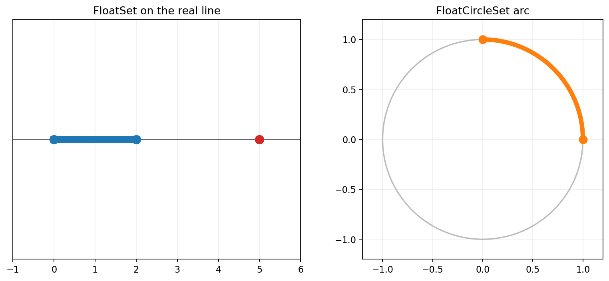
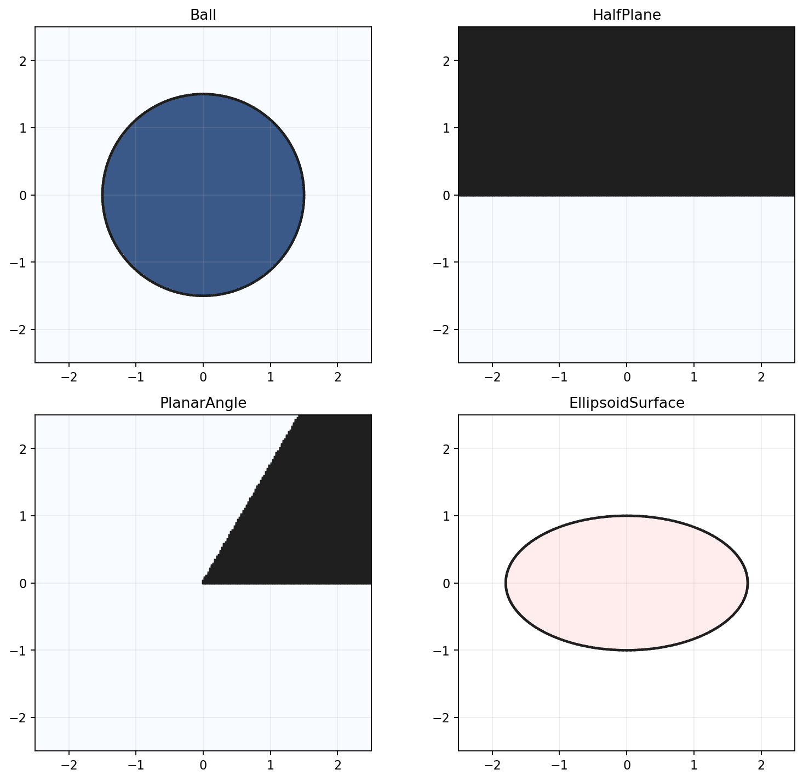
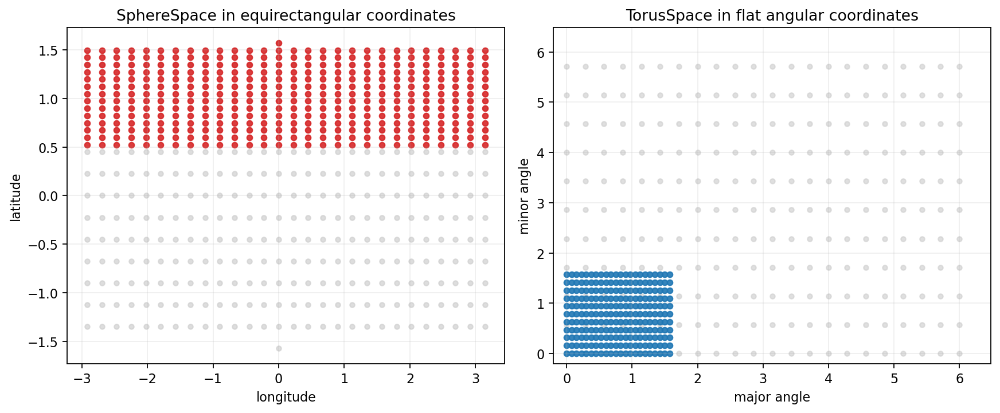
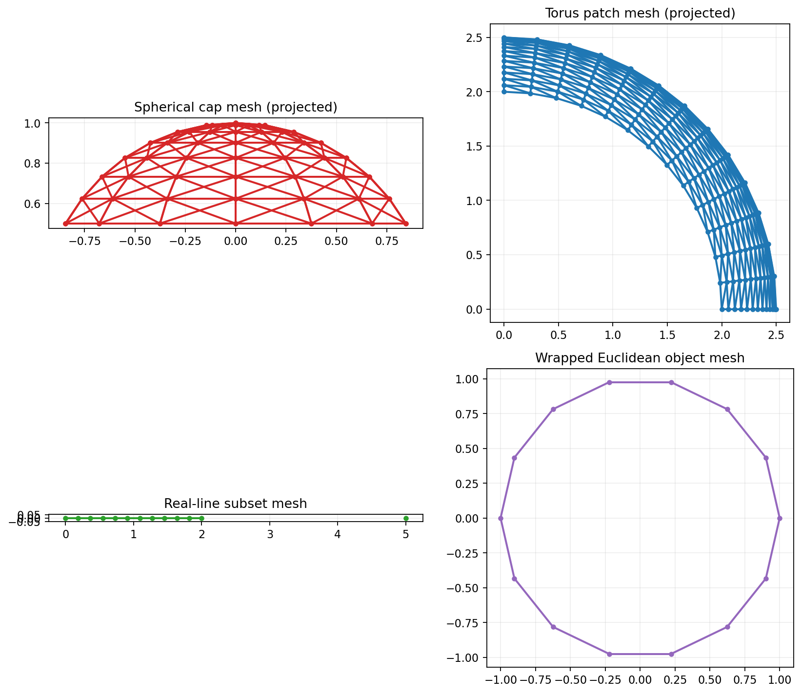
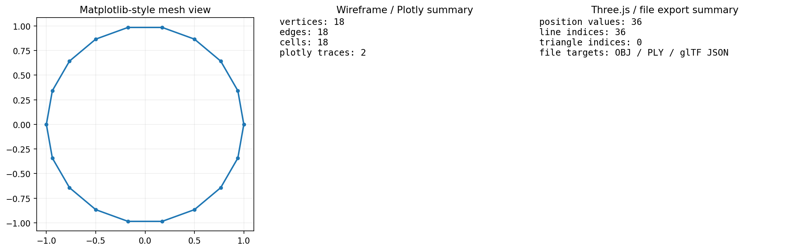
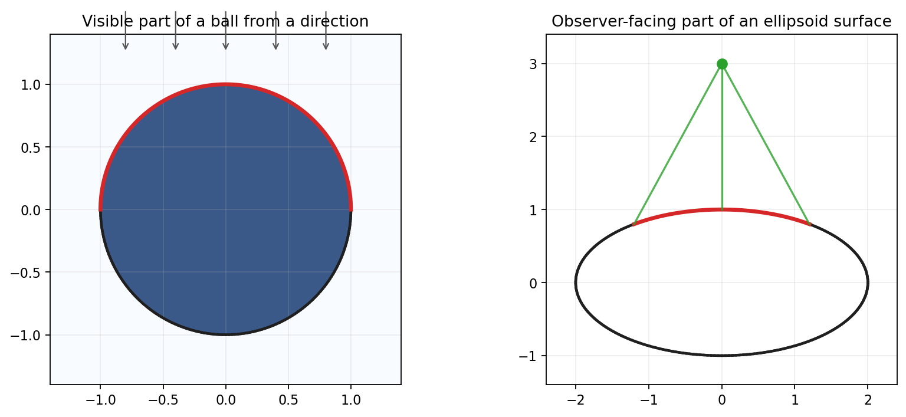
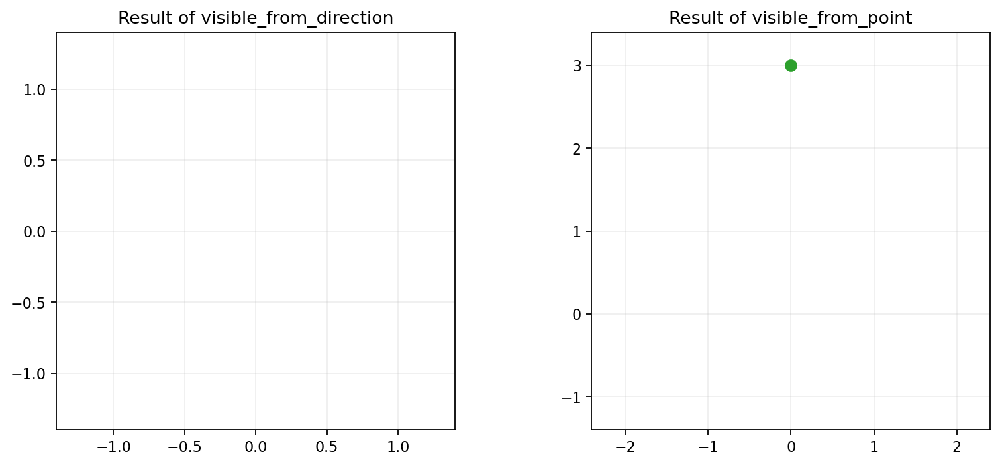
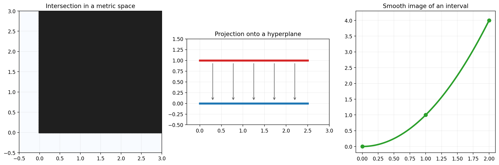

User Guide
==========

This guide collects a few typical workflows that the package already supports
well.

1. Build and combine sets on the real line and on the circle.
2. Use ready-made Euclidean objects from the object zoo.
3. Compose objects inside a named metric space.
4. Extract visible parts from convex Euclidean objects.
5. Transport objects by projection and smooth maps.

Working With Sets on the Line and Circle
----------------------------------------

The lowest layer of the package is useful when the main task is set-theoretic
modeling rather than differential geometry.

.. code-block:: python

   import math

   from geo import FloatCircleSet, FloatSet

   line_set = FloatSet((0.0, 2.0), 5.0)
   circle_set = FloatCircleSet.from_single_interval(0.0, math.pi / 2.0)

   print(1.0 in line_set)
   print(3.0 in line_set)
   print(math.pi / 4.0 in circle_set)
   print(math.pi in circle_set)

In the real-line constructor, a single numeric pair such as ``(0.0, 2.0)``
means one interval, while a scalar such as ``5.0`` means one point.

The normalization rule follows the explicit ``float`` lattice model: intervals
are merged not only when they overlap, but also when there is no representable
``float`` between them.

This is a good fit for:

- finite unions of intervals on the real line;
- arcs on the unit circle;
- exact set operations on representable ``float`` values.

Using the Euclidean Object Zoo
------------------------------

The next layer provides ready-made geometric objects in Euclidean spaces. This
is the fastest way to build examples with interior, boundary, and local cone
models.

.. code-block:: python

   import math

   from geo import Ball, EllipsoidSurface, FloatPoint, HalfPlane, PlanarAngle

   ball = Ball(FloatPoint(0.0, 0.0), 1.5)
   upper_half_plane = HalfPlane((0.0, 1.0), offset=0.0)
   angle = PlanarAngle(FloatPoint(0.0, 0.0), 0.0, math.pi / 3.0)
   boundary = EllipsoidSurface(
       FloatPoint(0.0, 0.0),
       ((1.8, 0.0), (0.0, 1.0)),
   )

   print(FloatPoint(0.0, 0.0) in ball)
   print(FloatPoint(0.0, -1.0) in upper_half_plane)
   print(FloatPoint(1.0, 0.5) in angle)
   print(boundary.mesh().cells[:3])

This is the right layer for:

- balls, spheres, ellipsoids, cubes, and parallelepipeds;
- affine half-spaces and hyperplanes;
- planar examples with visible boundary structure.

Working in a Metric Space
-------------------------

The metric-space layer wraps charted objects into a named ambient space and adds
set-theoretic operations between objects that live in the same space.

.. code-block:: python

   import math

   from geo import EuclideanPlaneSpace, FloatPoint

   plane = EuclideanPlaneSpace()
   upper = plane.half_plane((0.0, 1.0), offset=0.0)
   right = plane.half_plane((1.0, 0.0), offset=0.0)
   quadrant = upper & right
   angle = plane.angle(FloatPoint(0.0, 0.0), 0.0, math.pi / 2.0)

   print(FloatPoint(1.0, 1.0) in quadrant)
   print(FloatPoint(-1.0, 1.0) in quadrant)
   print(FloatPoint(1.0, 1.0) in angle)
   print(len(quadrant.mesh(bounds=((-0.2, 2.0), (-0.2, 2.0))).cells))

This is the main layer to use when the answer should depend on the ambient
space rather than on a standalone Euclidean predicate. The resulting objects
keep the usual object API, so after one construction step you can continue with
membership checks, Boolean operations, local models, sampling, and meshing.

Typical use cases are:

- intersections and unions inside one ambient space;
- examples where the ambient space matters explicitly;
- building reusable objects through the standard factories of
  ``RealLineSpace``, ``UnitCircleSpace``, and ``EuclideanPlaneSpace``.

Spaces With Visualization Embeddings
------------------------------------

When you need both intrinsic distances and deterministic coordinates for
rendering, use the ``Space`` layer.

.. code-block:: python

   import math

   from geo import SphereSpace, TorusSpace

   sphere = SphereSpace(radius=1.0)
   first = sphere.point_from_angles(0.0, 0.0)
   second = sphere.point_from_angles(math.pi / 2.0, 0.0)

   print(sphere.distance(first, second))
   print(sphere.to_3d(first))
   print(sphere.to_2d(second, method="equirectangular"))

   torus = TorusSpace()
   print(torus.distance((0.0, 0.0), (math.pi, 0.0)))
   print(torus.to_3d((0.0, 0.0)))

This layer is the bridge between intrinsic geometry and reproducible
visualization. A ``Space`` instance answers metric questions such as
``distance()`` and also exposes deterministic embeddings:

- ``to_2d()`` for charts, flat angular coordinates, or equirectangular views;
- ``to_3d()`` for embedded rendering coordinates;
- native object factories such as ``cap()`` and ``patch()`` in spaces that
  support them.

The next figure shows the same idea in two common settings: a spherical cap in
equirectangular coordinates and a torus patch in flat angular coordinates.

Point Transforms Between Spaces
-------------------------------

Use the transform layer when you want an explicit reusable point map instead of
calling ``to_2d()`` or ``to_3d()`` directly.

.. code-block:: python

   import math

   from geo import SphereSpace, visualization_transform_3d

   sphere = SphereSpace(radius=2.0)
   transform = visualization_transform_3d(sphere)
   point = sphere.point_from_angles(math.pi / 2.0, 0.0)

   print(transform(point))

Native Objects on Sphere and Torus
----------------------------------

The first non-Euclidean object families are intentionally small but explicit.

.. code-block:: python

   import math

   from geo import SphereSpace, TorusPoint, TorusSpace

   sphere = SphereSpace()
   north = sphere.point_from_angles(0.0, math.pi / 2.0)
   hemisphere = sphere.cap(north, math.pi / 2.0)

   torus = TorusSpace()
   patch = torus.patch((0.0, math.pi / 2.0), (0.0, math.pi / 2.0))

   print(north in hemisphere)
   print(sphere.point_from_angles(0.0, -math.pi / 2.0) in hemisphere)
   print(TorusPoint(math.pi / 4.0, math.pi / 4.0) in patch)

The important point is that these are native geometric objects, not only helper
predicates. They participate in the same object workflows as the Euclidean zoo:
containment, local boundary models, Boolean composition inside one space,
sampling, and meshing.

Sampling and Meshes for Visualization
-------------------------------------

For rendering workflows, the new spaces can now provide embedded sample points
and triangle meshes directly.

.. code-block:: python

   import math

   from geo import SphereSpace, TorusSpace

   sphere = SphereSpace()
   sphere_mesh = sphere.mesh(resolution=12)
   cap_mesh = sphere.cap_mesh(
       sphere.point_from_angles(0.0, math.pi / 2.0),
       math.pi / 3.0,
       resolution=12,
   )

   torus = TorusSpace()
   torus_mesh = torus.mesh(resolution=16)
   patch_mesh = torus.patch_mesh(
       (0.0, math.pi / 2.0),
       (0.0, math.pi / 2.0),
       resolution=12,
   )

   print(len(sphere_mesh.vertices), len(sphere_mesh.cells))
   print(len(cap_mesh.vertices), len(cap_mesh.cells))
   print(len(torus_mesh.vertices), len(torus_mesh.cells))
   print(len(patch_mesh.vertices), len(patch_mesh.cells))

Use the space-level methods when you want a canonical mesh of the whole ambient
space or when a rendering pipeline is organized around the space first and the
object second. This is especially convenient for visual overviews, parameter
sweeps, and reusable scene setup.

Object-Level Sampling and Meshes
--------------------------------

The native objects on sphere and torus now expose their own sampling and mesh
methods directly.

.. code-block:: python

   import math

   from geo import SphereSpace, TorusSpace

   sphere = SphereSpace()
   cap = sphere.cap(
       sphere.point_from_angles(0.0, math.pi / 2.0),
       math.pi / 3.0,
   )

   torus = TorusSpace()
   patch = torus.patch((0.0, math.pi / 2.0), (0.0, math.pi / 2.0))

   print(len(cap.sample_points(resolution=12)))
   print(len(cap.mesh(resolution=12).cells))
   print(len(patch.sample_points(resolution=12)))
   print(len(patch.mesh(resolution=12).cells))

This object-level API is the better choice when the object is already the main
unit of work. The usual pattern is:

1. build a space;
2. build one native object inside it;
3. sample or mesh that object directly;
4. hand the resulting ``ObjectMesh`` to plotting or file export.

Broader Object Zoo Sampling
---------------------------

The same object-level API now works for more of the standard zoo, not only for
the new sphere and torus objects.

.. code-block:: python

   import math

   from geo import EuclideanPlaneSpace, RealLineSpace, UnitCircleSpace

   line = RealLineSpace().subset((0.0, 2.0), 5.0)
   arc = UnitCircleSpace().arc(0.0, math.pi / 2.0)
   disk = EuclideanPlaneSpace().point((0.0, 0.0))

   print(len(line.sample_points(resolution=8)))
   print(len(line.mesh(resolution=8).cells))
   print(len(arc.sample_points(resolution=8)))
   print(len(arc.mesh(resolution=8).cells))
   print(len(disk.sample_points(resolution=8)))

The same mental model now works across several families:

- line subsets and circle arcs;
- native sphere and torus objects;
- wrapped charted Euclidean objects when the source object already supports
  meshing.

The figure below shows four representative outputs of that shared sampling and
meshing layer.

Export Adapters for ObjectMesh
------------------------------

`ObjectMesh` now exposes plain export adapters, so the same mesh can feed
different rendering layers without a hard dependency on any plotting library.

.. code-block:: python

   from geo import Ball, FloatPoint

   mesh = Ball(FloatPoint(0.0, 0.0), 1.0).mesh(resolution=12)

   wireframe = mesh.wireframe_data()
   matplotlib_data = mesh.matplotlib_data()
   plotly_data = mesh.plotly_data(name="disk")
   threejs_data = mesh.threejs_data()

   print(wireframe["edges"][:3])
   print(plotly_data[0]["type"])
   print(len(threejs_data["position"]))

This is the lowest-friction integration point for downstream tools. The mesh
stays inside plain Python data structures, so you can:

- inspect edges and cells in tests;
- pass arrays into plotting code;
- serialize the same geometry into web-friendly data formats.

Ready Plot Helpers and File Export
----------------------------------

When optional plotting dependencies are installed, you can also build figures
directly or write standard mesh files.

.. code-block:: python

   from pathlib import Path

   from geo import Ball, FloatPoint, plot_mesh_matplotlib, write_obj

   mesh = Ball(FloatPoint(0.0, 0.0), 1.0).mesh(resolution=12)

   figure, axis = plot_mesh_matplotlib(mesh)
   write_obj(mesh, Path("disk.obj"))

   print(type(figure).__name__)

The matching example scripts in ``examples/05_space_object_mesh_pipeline.py``,
``examples/06_metric_object_zoo_pipeline.py``, and
``examples/07_plot_and_export_pipeline.py`` show the same workflow end to end:

1. define a space or a standard object;
2. build a native or wrapped geometric object;
3. obtain an ``ObjectMesh``;
4. plot it or export it as ``OBJ``, ``PLY``, or ``glTF``-friendly JSON.

Visibility From a Direction or an Observer
------------------------------------------

For convex Euclidean families, the package can build the visible part as a new
geometric object.

.. code-block:: python

   from geo import Ball, EllipsoidSurface, EuclideanPlaneSpace, FloatPoint
   from geo import MetricGeometricObject

   plane = EuclideanPlaneSpace()

   disk = MetricGeometricObject.from_charted(
       plane,
       Ball(FloatPoint(0.0, 0.0), 1.0),
   )
   top_half = disk.visible_from_direction((0.0, 1.0))

   ellipse = MetricGeometricObject.from_charted(
       plane,
       EllipsoidSurface(FloatPoint(0.0, 0.0), ((2.0, 0.0), (0.0, 1.0))),
   )
   visible_arc = ellipse.visible_from_point(FloatPoint(0.0, 3.0))

   print(FloatPoint(0.0, 1.0) in top_half)
   print(FloatPoint(0.0, -1.0) in top_half)
   print(FloatPoint(1.2, 0.8) in visible_arc)
   print(FloatPoint(0.0, -1.0) in visible_arc)

This is useful when you need:

- the illuminated or front-facing part of a sphere, ball, or ellipsoid;
- the observer-facing arc of a smooth convex boundary;
- a new object with a local cone model, not just a rendered subset.

The next figure shows the geometric objects returned by the visibility
operations themselves.

Projecting Objects and Building Smooth Images
---------------------------------------------

Higher-level workflows become useful when an object should be transported to a
new place instead of being rebuilt from scratch.

.. code-block:: python

   import math

   from geo import EuclideanNeighborhood, EuclideanPlaneSpace, FloatPoint
   from geo import FloatVector, Hyperplane, ManifoldChart, RealLineSpace
   from geo import MetricGeometricObject

   plane = EuclideanPlaneSpace()
   source_line = MetricGeometricObject.from_charted(
       plane,
       Hyperplane((0.0, 1.0), offset=1.0),
   )
   source_half_line = source_line & plane.half_plane((1.0, 0.0), offset=0.0)
   target_line = Hyperplane((0.0, 1.0), offset=0.0)

   projected = source_half_line.project_along_direction_onto(
       Hyperplane((0.0, 1.0), offset=1.0),
       target_line,
       (0.0, -1.0),
   )

   source_space = RealLineSpace()
   interval = source_space.subset((0.0, 2.0))

   def target_chart(point):
       center = FloatPoint(point)
       return ManifoldChart(
           lambda candidate: FloatPoint(candidate) - center,
           lambda coordinates: center + FloatVector(coordinates),
           dim=2,
           domain_contains=plane.contains,
           image=EuclideanNeighborhood.whole(2),
       )

   parabola = interval.image_under_smooth_map(
       lambda point: FloatPoint(point, point * point),
       lambda point: float(FloatPoint(point)[0]),
       plane,
       target_chart,
       contains_image_point=lambda point: (
           0.0 <= FloatPoint(point)[0] <= 2.0 and
           math.isclose(
               FloatPoint(point)[1],
               FloatPoint(point)[0] * FloatPoint(point)[0],
           )
       ),
   )

   print(FloatPoint(1.0, 0.0) in projected)
   print(FloatPoint(1.0, 1.0) in parabola)

Use this layer when you need:

- parallel or central projection onto a target hyperplane;
- visible caps and observer-facing subsets of convex Euclidean objects;
- geometric objects defined as images of source objects;
- workflows that mix explicit geometry with local differential structure.

Rebuilding the Images
---------------------

The static figures in this page are generated by::

   python doc/generate_user_guide_images.py

This keeps the documentation reproducible and avoids storing notebook output as
the only source of the illustrations.
